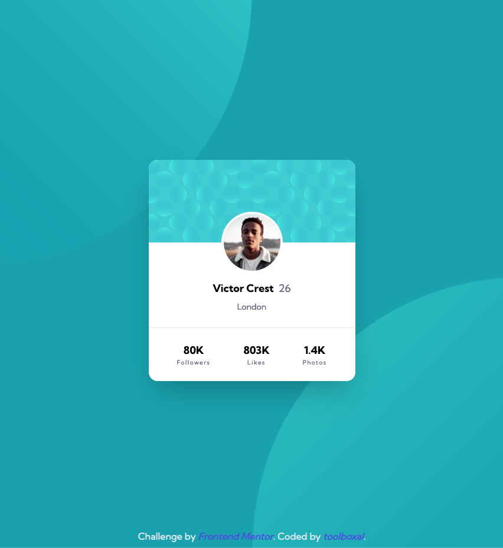

# Frontend Mentor - Profile card component solution

### Screenshot

### Links

- FEM Solution Site: [Add solution URL here](<[https:/](https://www.frontendmentor.io/solutions/profile-card-using-tailwind-gTraXn8sNL)>)
- Live Site URL: [Add live site URL here](https://fem-profilecard-main-toolboxal.netlify.app/)

## My process

### Built with

- Semantic HTML5 markup
- Tailwindcss
- Mobile-first workflow
